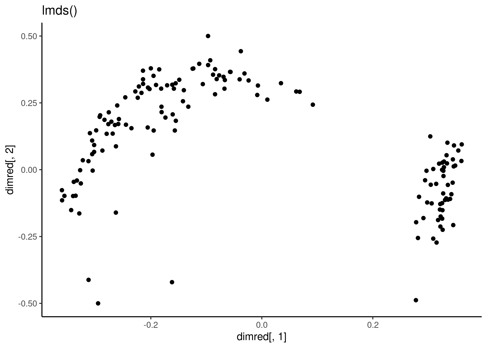
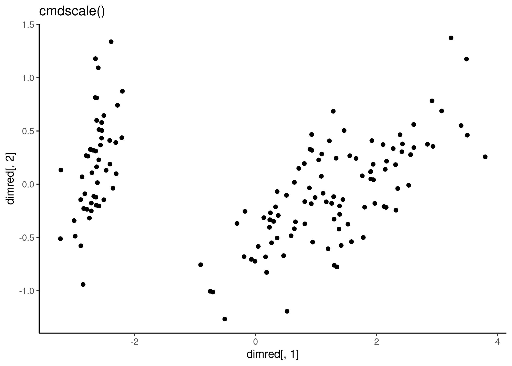
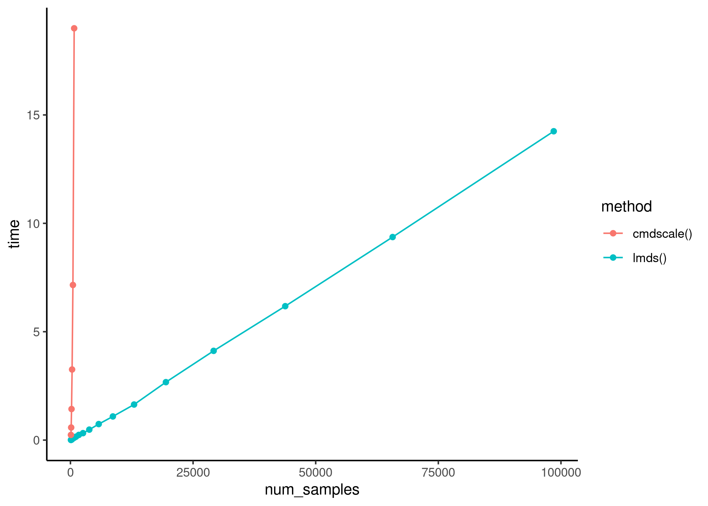

lmds
================

<!-- badges: start -->
[](https://github.com/dynverse/lmds/actions/workflows/R-CMD-check.yaml)
<!-- badges: end -->

# `lmds`: Landmark Multi-Dimensional Scaling

A fast dimensionality reduction method scaleable to large numbers of
samples. Landmark Multi-Dimensional Scaling (LMDS) is an extension of
classical Torgerson MDS, but rather than calculating a complete distance
matrix between all pairs of samples, only the distances between a set of
landmarks and the samples are calculated.

``` r
library(lmds)
x <- as.matrix(iris[,1:4])
dimred <- lmds(x, ndim = 2)
qplot(dimred[,1], dimred[,2]) + labs(title = "lmds()") + theme_classic()
#> Warning: `qplot()` was deprecated in ggplot2 3.4.0.
#> This warning is displayed once every 8 hours.
#> Call `lifecycle::last_lifecycle_warnings()` to see where this warning was generated.
```



``` r
dimred <- cmdscale(dist(x))
qplot(dimred[,1], dimred[,2]) + labs(title = "cmdscale()") + theme_classic()
```



## Execution time

The execution time of `lmds()` scales linearly with respect to the
dataset size. 

## Latest changes

Check out `news(package = "lmds")` or [NEWS.md](NEWS.md) for a full list
of changes.

<!-- This section gets automatically generated from inst/NEWS.md, and also generates inst/NEWS -->

### Recent changes in lmds 0.1.0

Initial release of lmds.

-   A fast dimensionality reduction method scaleable to large numbers of
    samples. Landmark Multi-Dimensional Scaling (LMDS) is an extension
    of classical Torgerson MDS, but rather than calculating a complete
    distance matrix between all pairs of samples, only the distances
    between a set of landmarks and the samples are calculated.
